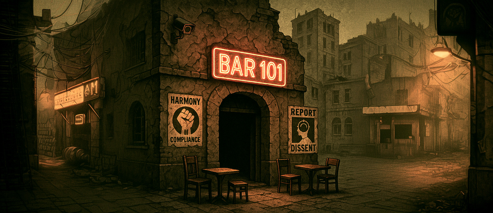
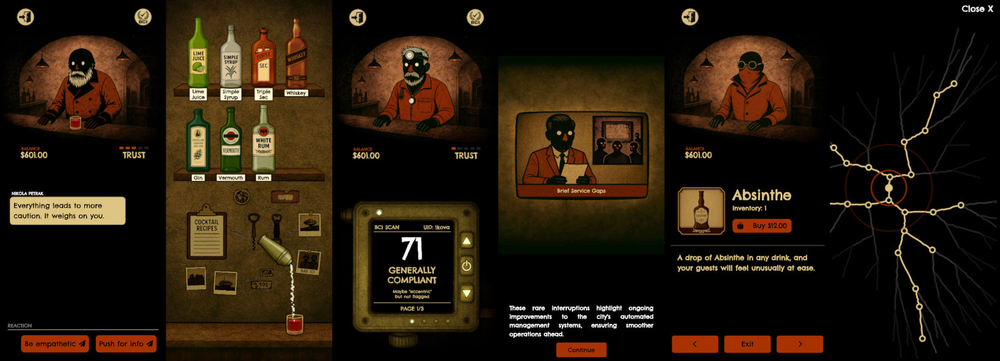

# Bar 101: A Tale of Secrets in Stenograd

Welcome to Bar 101, a narrative-driven game set in the dystopian city of Stenograd, where you'll play as a bartender navigating a world controlled by the Behavioral Compliance Index (BCI) - an all-seeing system that scores every citizen's behavior in real-time.

## Technology Stack

Bar 101 is built as a modern web application using **React.js** for the UI framework and **Pixi.js** for 2D rendering and game mechanics. The game's narrative and plot are dynamically generated using AI (**Open AI ChatGPT**) with custom **Python scripting** for story management. Visual assets are created through AI tools including **OpenAI**, **Midjourney**, and **VITS/VCTK** for voice synthesis. The entire infrastructure is managed as code on **AWS** using **Terraform**, providing a scalable and cost-effective hosting solution.

The game is an experiment in AI-driven game development. It explores how far generative AI can go in creating compelling, interactive content—from storylines and character behavior to visuals and audio—minimizing the need for traditional manual asset creation while maintaining an engaging player experience.

## Quick Links
- **[Play the Demo](https://bar101.jmrlab.com)**
- [Game Assets](bar101-assets)
- [Story Generation](bar101-storyline-gen)
- [Audio Generation](bar101-voiceover)
- [Game Engine](bar101-game)
- [Infrastructure as Code](bar101-infra)

## The World of Stenograd

By 2025, Stenograd has transformed into a city where governance looks more like infrastructure than politics. The BCI, a sophisticated system built by the late Marek Halden, monitors everything: government records, financial activity, transport data, online behavior, health systems, and biometric surveillance. Your BCI score determines your access to housing, services, and jobs. A low score brings delays, reroutes, and quiet denials.

But beneath this controlled surface lies Bar 101 - your sanctuary, hidden three stories underground in a disused tram station. Here, bureaucrats drink beside smugglers, system architects sit near off-grid ghosts, and everyone pretends not to listen. No cameras, no ID checks, no digital payments. Some think it's protected. Others think it's bait.

## Your Role as the Bartender

As Alex Radan, a former systems technician with a mysterious past, you'll:
- Mix drinks and build relationships with your customers
- Learn about the events shaping Stenograd's future
- Influence the city's future through your interactions
- Navigate the complex web of Council factions: Harmonists, Innovators, and the Directorate

## Game Mechanics

### Social Engineering
- Build trust with customers through meaningful conversations
- Learn about the city's secrets and hidden truths
- Make choices that affect your relationships and the city's future
- Uncover the mystery of Marek Halden, the brilliant but controversial architect of the BCI system, whose sudden death left behind a legacy of unanswered questions and a system that's beginning to show cracks

### Mixology
- Master the art of cocktail making with an intuitive mixing system
- Create perfect drinks to impress your customers
- Learn customer preferences and serve their favorites
- Use your bartending skills to gain trust and information

## A Living, Breathing Story

Bar 101 features:
- 128 unique endings based on your choices and relationships
- Dynamic story progression shaped by your interactions
- Rich character backgrounds and evolving relationships
- Multiple story paths that reflect the complexity of Stenograd's society

## Technical Innovation

This game pushes the boundaries of AI-driven content creation:
- AI-generated narrative variations ensuring unique experiences
- Procedurally generated story branches
- AI-created game assets including graphics and voiceovers
- Dynamic dialogue system that adapts to player choices

## Your Choices Matter

Every interaction in Bar 101 has consequences:
- Help customers or focus on your own interests
- Support different factions or play them against each other
- Uncover the truth about the BCI or maintain the status quo
- Shape Stenograd's future through your actions

Welcome to Bar 101. The drinks are cold, the secrets are hot, and the future of Stenograd is in your hands.

---

*"In a city where everything is monitored, the most dangerous place is where no one is watching."*
