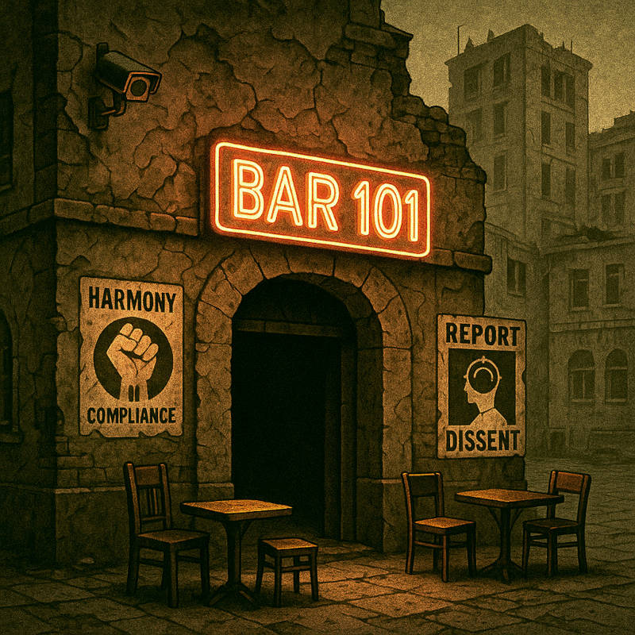

# Bar101 Assets

This directory contains all the assets used in the Bar101 application. Below is a comprehensive overview of the assets structure and their purposes.

## Directory Structure

### Root Assets
- `bar.png` - Main bar background image
- `bar101-entrence.png` - Bar entrance image
- `bar.xcf` - GIMP source file for bar design
- `bci_logo.png` - BCI logo image
- `loading.png` - Loading screen image
- `product_emblem_template.png` - Template for product emblems
- `trader.png` - Trader character image

### Subdirectories

#### `/audio`
Contains audio files used in the application:
- `bar101.mp3` - Main background music/audio

#### `/characters`
Contains character portraits:
- `dtomenko.png`
- `lkova.png`
- `npetrak.png`
- `olintz.png`
- `rmiskovic.png`
- `shalek.png`

#### `/drinks`
Contains drink-related assets and images.

#### `/mixing`
Contains assets related to drink mixing mechanics.

#### `/news`
Contains news-related assets and images.

#### `/products`
Contains product-related assets and images.

## File Formats
- Images are primarily in PNG format for transparency support
- Source files are in XCF format (GIMP)
- Audio files are in MP3 format

## Usage Guidelines
1. Maintain the original aspect ratios when using these assets
2. Use the provided templates (e.g., `product_emblem_template.png`) for consistency
3. Keep the file structure organized and add new assets to their appropriate directories
4. When adding new assets, ensure they follow the existing naming conventions

## Image Generation and Processing
All images in this directory were initially generated using the OpenAI GPT-4o model. These files represent the raw outputs from the AI model. Each image has undergone post-processing which includes:
- Scaling to appropriate dimensions
- Adjusting levels and colors for optimal appearance
- Adding transparency where needed
- Fine-tuning for consistency across the application