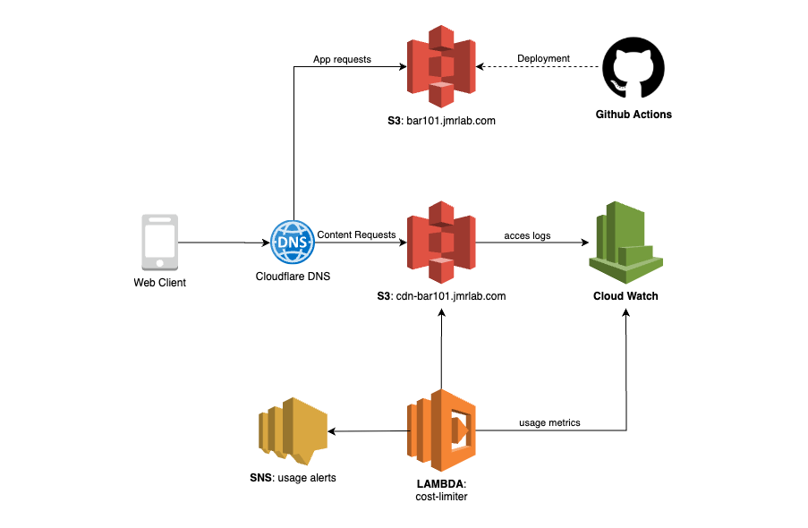

# Bar101 Infrastructure

A low-cost infrastructure setup for the Bar101 hobby project, optimized for minimal operational costs while providing reliable hosting and content delivery.

## Architecture Overview

The infrastructure leverages cost-effective AWS S3 static hosting combined with CloudFlare for DNS management and CDN capabilities, enhanced with automated cost protection.



### Core Components

**Static Hosting (S3)**
- **Main Application**: `bar101.jmrlab.com` - S3 bucket hosting game files and web assets
- **CDN Assets**: `cdn-bar101.jmrlab.com` - Dedicated S3 bucket for voiceover files and media content

**DNS & CDN**
- **CloudFlare**: DNS configuration and free CDN tier for improved performance and cost optimization

**Cost Protection**
- **Lambda Functions**: Automatically blocks S3 access when cost thresholds are exceeded
- **CloudWatch Alarms**: Real-time monitoring with warning (80%) and blocking (100%) thresholds
- **Automatic Access Restoration**: Restores access when cost is back below threshold

**CI/CD Pipeline**
- **GitHub Actions**: Automated build and deployment pipelines for continuous delivery
- Triggers on code changes for seamless updates to S3 buckets

## Project Structure

The Terraform infrastructure is organized by business function rather than technology, making it easy to understand and maintain:

```
bar101-infra/
├── terraform/               # Terraform configuration files
│   ├── ...
│   └── lambda/
│       └── cost-limiter/    # Lambda function source code
│           ├── ...
└── README.md               # This file
```

## Cost Optimization Strategy

This setup prioritizes minimal operational costs suitable for a hobby project, with multiple layers of protection and optimization:

- **S3 Static Hosting**: Pay-per-use storage and bandwidth
- **CloudFlare Free Tier**: No-cost DNS management, global CDN, and free HTTPS certificates
- **Aggressive CloudFlare Caching**: 30-day cache for CDN assets dramatically reduces S3 bandwidth usage and costs
- **GitHub Actions**: Free tier provides sufficient CI/CD minutes for hobby projects
- **Automated Cost Protection**: Prevents runaway charges while maintaining core functionality (default: 10GB ≈ $0.90/day)
- **No Server Costs**: Serverless architecture eliminates ongoing compute expenses
- **Graceful Degradation**: Game remains playable even when cost limits trigger - only voiceovers are affected

The combination of CloudFlare's aggressive caching and the cost protection system ensures that:
1. Most user requests are served from CloudFlare's cache (no AWS charges)
2. Only cache misses or expired content trigger S3 downloads
3. If unusual traffic spikes occur, automatic protection kicks in
4. Users experience minimal impact (game works, just without voice narration)

## Deployment Flow

1. Code pushed to GitHub repository
2. GitHub Actions triggered automatically
3. Build process compiles and optimized assets
4. Deployment uploads files to `bar101.jmrlab.com` S3 bucket (voiceovers must be manually uploaded to `cdn-bar101.jmrlab.com` S3 bucket - too many files to sync automatically)


### Why Cost Protection?

This cost protection system was specifically designed for Bar101 as a **hobby project** where keeping operational costs predictable and minimal is essential.

### How It Works
1. **CloudWatch Metrics**: Monitors `BytesDownloaded` from the CDN bucket with 24-hour rolling windows
2. **Alarms**: Warning at 80% and blocking at 100% of daily limit
3. **Lambda Function**: Automatically blocks/unblocks S3 access based on usage
4. **Automatic Access Restoration**: Restores access when cost is back below threshold
5. **SNS Notifications**: Email alerts for all usage events and status changes

# Installation

## Prerequisites

Before installing the infrastructure, ensure you have:

1. **AWS Account**: Active AWS account with appropriate permissions
2. **AWS CLI**: Configured with your credentials
3. **CloudFlare Account**: For DNS management (if using custom domain)
4. **Cloudflare API Token**: Required for Terraform to manage DNS records

## Terraform Installation (MacOS)

Install Terraform using Homebrew:

```bash
# Add HashiCorp tap to Homebrew
brew tap hashicorp/tap

# Install Terraform
brew install hashicorp/tap/terraform

# Verify installation
terraform -v
```

## AWS Configuration

Configure your AWS credentials (choose one method):

### Option 1: AWS CLI Configuration
```bash
aws configure
```

### Option 2: Environment Variables
```bash
export AWS_ACCESS_KEY_ID="your-access-key"
export AWS_SECRET_ACCESS_KEY="your-secret-key"
export AWS_DEFAULT_REGION="us-east-1"
```

### Option 3: AWS Credentials File
Create `~/.aws/credentials`:
```ini
[default]
aws_access_key_id = your-access-key
aws_secret_access_key = your-secret-key
```

## Cloudflare Configuration

### Create API Token
1. Go to [Cloudflare API Tokens](https://dash.cloudflare.com/profile/api-tokens)
2. Click "Create Token"
3. Use "Custom token" with the following permissions:
   - **Zone:Zone:Read** (for the `jmrlab.com` zone)
   - **Zone:DNS:Edit** (for the `jmrlab.com` zone)

### Set Environment Variable
```bash
export CLOUDFLARE_API_TOKEN="your-api-token-here"
```

Or alternatively, use email + Global API Key:
```bash
export CLOUDFLARE_EMAIL="your-email@example.com"
export CLOUDFLARE_API_KEY="your-global-api-key"
```

## Infrastructure Deployment

1. **Navigate to Terraform directory**:
   ```bash
   cd bar101-infra/terraform
   ```

2. **Initialize Terraform**:
   ```bash
   terraform init
   ```
   This downloads the required providers and sets up the backend.

3. **Configure your settings**:
   ```bash
   cp terraform.tfvars.example terraform.tfvars
   # Edit terraform.tfvars with your values
   ```

4. **Review the deployment plan**:
   ```bash
   terraform plan
   ```
   This shows what resources will be created without making any changes.

5. **Apply the infrastructure**:
   ```bash
   terraform apply
   ```
   Review the plan and type `yes` to confirm deployment.

## Monitoring and Management

After deployment, you can monitor your infrastructure:

### CloudWatch Resources
- **Alarms**: `cost-limiter-daily-transfer-warning` and `cost-limiter-daily-transfer-exceeded`
- **Lambda Logs**: `/aws/lambda/cost-limiter`
- **Metrics**: S3 `BytesDownloaded` for your CDN bucket

### SNS Notifications
- **Topic**: `cost-limiter-alerts`
- **Email Subscription**: Configured with your `alert_email`

### Manual Operations

Check current usage:
```bash
aws cloudwatch get-metric-statistics \
  --namespace AWS/S3 \
  --metric-name BytesDownloaded \
  --dimensions Name=BucketName,Value=cdn-bar101.jmrlab.com \
  --start-time $(date -u -d '24 hours ago' +%Y-%m-%dT%H:%M:%S) \
  --end-time $(date -u +%Y-%m-%dT%H:%M:%S) \
  --period 86400 \
  --statistics Sum
```

Manually trigger cost-limiter:
```bash
aws lambda invoke \
  --function-name cost-limiter \
  --payload '{}' \
  response.json
```

## Troubleshooting

### Common Issues

1. **CloudWatch Metrics Not Available**
   - S3 request metrics need to be enabled
   - Allow 15-30 minutes for metrics to appear after first requests

2. **Lambda Not Triggering**
   - Check CloudWatch alarm state
   - Verify Lambda permissions for S3 and SNS
   - Check Lambda logs in CloudWatch: `/aws/lambda/cost-limiter`

3. **Access Still Blocked**
   - Check current bucket policy in S3 console
   - Manually trigger unblock by invoking Lambda
   - Verify daily reset schedule (EventBridge rule)