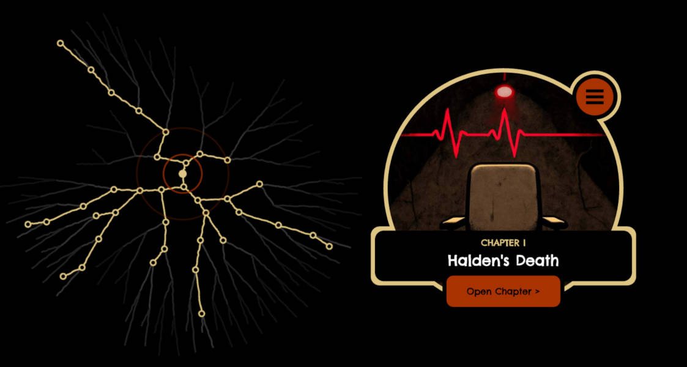
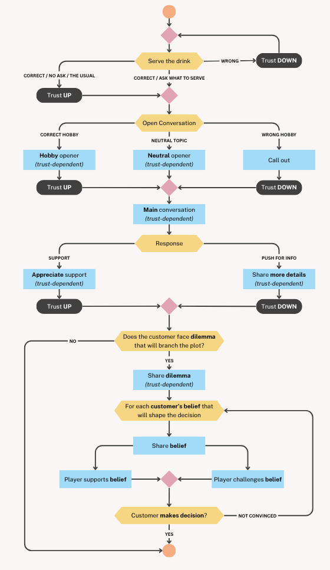

# Bar101 Storyline Generator

A Python-based tool for generating complex branching storylines for the Bar 101 game. This project uses advanced prompt engineering techniques with OpenAI's API to create a tree of 128 unique story paths, each branching at 7 decision points. The system ensures narrative coherence, logical progression, and engaging variations across all possible story branches.



## Story Generation Flow

The story begins with an initial context and a sequence of events. From there, the generator builds a tree of all possible story branches, based on the decisions made by Bar 101’s customers. The player can influence these decisions.

To structure the story properly, each level of the tree is generated using specific guidelines. For more details, refer to: `/bar101-storyline-gen/context/plot_shaper.json`


## Dialogues Flow

The most advanced part of the story is the dialogue system, which reveals key parts of the plot. Dialogues are influenced by the customer's trust level, and each one has five different variants.

In addition to revealing the story, dialogues can also be used to build trust and influence the customer's decisions. The flow below illustrates how this works in detail:



The direction of the plot depends on the choices made by the customer. They present a dilemma to the player and share their beliefs that support one option or the other.

The player can either support these beliefs or challenge them, influencing the story’s direction. The higher the trust level, the more impact the player has on the customer's decision and ultimately, on how the story unfolds.

## Prerequisites

- Python 3.11 or higher
- Git
- Make (for using Makefile commands)
- OpenAI API key

## Installation

1. Clone the repository:
```bash
git clone https://github.com/jamro/bar101.git
cd bar101-storyline-gen
```

2. Install dependencies using Poetry:
```bash
make install
```

3. Set up your environment variables:
```bash
echo "OPENAI_API_KEY=your_api_key_here" > .env
```

## Usage

### Running the Application

```bash
make run
```
The tool outputs its results in the `bar101-storyline-gen/story_tree` directory, using multiple JSON files. These files serve as a cache to avoid repeated GPT model calls, reducing costs.

The `story_tree` is organized as a tree of subdirectories - using folder names like `a` and `b` - which represent different branches of a story (e.g., `bar101-storyline-gen/story_tree/a/a/b/a/b/a/a`).

The tool traverses every branch, generating all possible plots. Once every path is generated, it switches to interactive mode, allowing the user to explore the story and choose the desired path. The chosen path determines how the plot unfolds.

### Extracting Nodes

To extract nodes from the story:

```bash
make extract-nodes
```

After the tool finishes generating all branches of the story tree, the output is saved in: `bar101-storyline-gen/story_tree`.

This directory includes all data used during plot generation - some of which is redundant or not needed for the game itself.

To reduce the amount of data loaded into the game, a node extraction step is performed. This process saves each story node as a separate JSON file. All extracted nodes are stored in: `bar101-storyline-gen/story_tree/node_x*.json` files.

This keeps the game lightweight while preserving the structure of the story.

## Development

### Code Quality

The project uses several tools to maintain code quality:

- Format code:
```bash
make format
```

- Run linter:
```bash
make lint
```

### Testing

Run the test suite with coverage report:
```bash
make test
```

## Project Structure

```
bar101-storyline-gen/
├── src/                    # Source code
├── tests/                  # Test files
├── assets/                 # Static assets
├── context/                # Story context information
├── story_tree/             # Output of the storyline generator
├── pyproject.toml          # Project configuration
└── Makefile                # Build commands
```